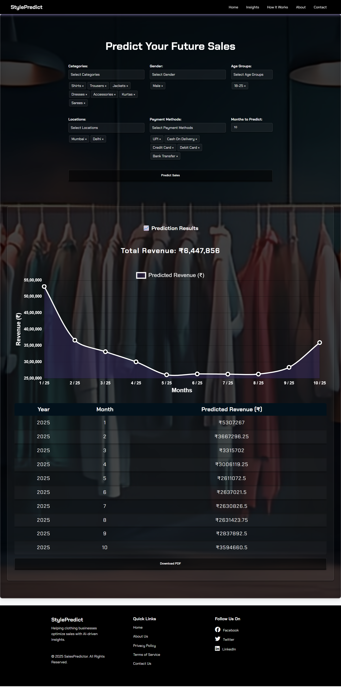

# 👗 StylePredict – Clothing Store Sales Prediction Model

> ML-powered web app to analyze and forecast e-commerce clothing sales with smart dashboards.


[](LICENSE)


---

## 🔗 Live Demo  
🌐 https://fashionforecast-h008.onrender.com/

---

## 💻 Tech Stack Used

- **Frontend**: HTML, CSS, JavaScript
- **Backend**: Python (Flask)
- **Machine Learning**: XGBoost, Scikit-learn, Pandas, NumPy
- **Visualization**: Matplotlib, Seaborn, Plotly
- **Deployment**: WSGI + Gunicorn

---

## 📌 Project Description

This project is a machine learning-powered dashboard built to **analyze and forecast e-commerce clothing store sales**.  
It includes detailed visualizations of trends, payment methods, and predicted sales based on historical transaction data.  

✅ **Why I built it:**  
To combine my knowledge of machine learning and web development into a full-stack project that solves a real-world business problem — helping businesses forecast future sales with clarity and interactivity.

---

## 🖼️ Screenshots

| Home Page | Prediction Page |
|-----------|------------------|
|  |  |

| Data Insights Page | 
|--------------------|
|  |

| How It Works |
|--------------|
|  |

| Contact Us | Privacy Policy |
|------------|----------------|
|  |  |

| About Us | 
|----------|
|  |


---

## ⭐ Features

- 📂 **Preloaded Dataset Analysis**  
  App uses a built-in historical transaction dataset — no upload required.

- 📊 **Insights Page for EDA (Exploratory Data Analysis)**  
  A dedicated “Insights” page shows visualizations such as category-wise sales, payment distributions, and trends — all rendered from backend-generated images.

- 🤖 **XGBoost Model-Based Prediction**  
  Sales forecasting is powered by a pre-trained XGBoost model built using realistic, real-world purchase behavior.

- 🎯 **Filter-Based Custom Predictions**  
  Users can dynamically adjust inputs like:
  - Product category  
  - Age group  
  - Gender  
  - Location  
  - Payment method  
  - Future time horizon (in months)

- 📈 **Forecast Future Sales**  
  App predicts total future sales (1 to 12 months ahead) based on filtered criteria and displays results with clear visual styling.

- 🌐 **Multiple Web Pages**  
  Fully structured frontend with the following routes/pages:
  - Home  
  - Prediction  
  - Insights (EDA)
  - How It Works
  - About Us  
  - Contact Us  
  - Privacy Policy  

- 📱 **Responsive UI**  
  The app is mobile-friendly on most pages (except Insights, currently desktop-optimized).

---

## 🛠 Installation / Usage Instructions


```bash
# Clone the repository
git clone https://github.com/HawaleShailesh004/Style-Predict.git
cd Style-Predict

# (Optional) Create and activate a virtual environment
python -m venv env
source env/bin/activate  # Windows: env\Scripts\activate

# Install dependencies
pip install -r requirements.txt

# Run the application
python app.py

```
Then open http://localhost:5000 in your browser.

# 🚧 Future Improvements / What I Learned 🔧

## Future Plans:
- **Improve the responsiveness** of the Insights page for a better user experience.
- **Add export options** (CSV/PDF) to allow easy downloading of predictions and results.

## What I Learned:
- **End-to-End ML Pipeline Integration**: Gained hands-on experience integrating the machine learning pipeline within a web app.
- **XGBoost Model**: Trained and deployed an XGBoost model to make accurate predictions.
- **Backend Image Rendering for EDA**: Implemented image rendering in the backend to support exploratory data analysis (EDA) effectively.
- **Frontend/Backend Interaction**: Facilitated seamless communication between the frontend and backend using Flask templates.
- **Dynamic Predictions with Filters**: Utilized practical filter implementation to create dynamic, user-tailored predictions.
- **Clean, Scalable Folder Structures**: Built a maintainable and scalable folder structure for the web app to enhance collaboration and project longevity.
  
## License
This project is licensed under the [MIT License](LICENSE).

## 🙋‍♂️ Author

**Shailesh Hawale**

## Contributors
**Shresha Sinha**
**Shravani Rodge**
**Aditi Bhoir**

- 📧 Email: [shaileshhawale004@gmail.com](mailto:shaileshhawale004@gmail.com)  
- 🐙 GitHub: [ShaileshHawale](https://github.com/HawaleShailesh004)

